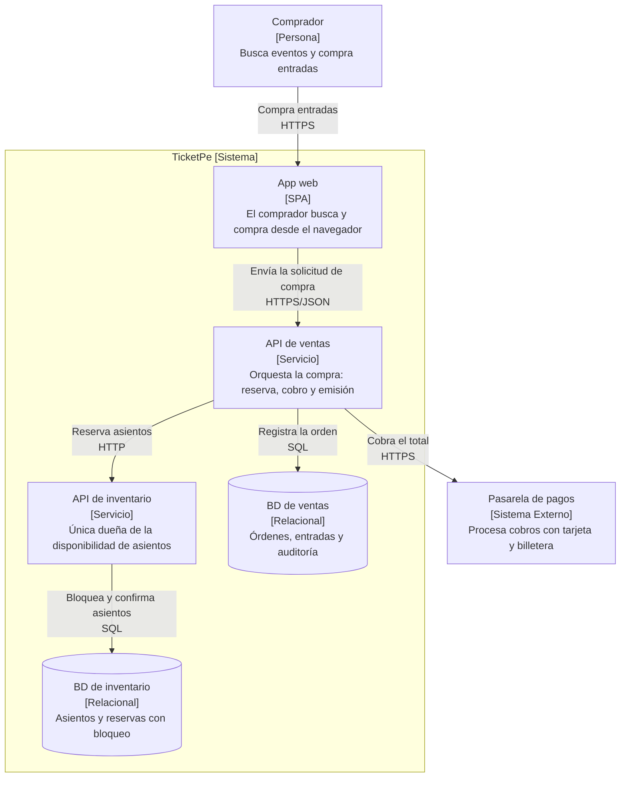
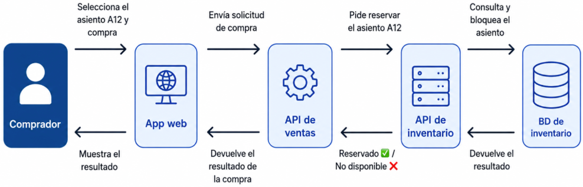

Un **contenedor** es una pieza que se despliega y se ejecuta por separado: webapp, api, bd.

**EC-01**

**EC-01 · Ninguna localidad se vende dos veces — RESUELTO**

**Requisitos de entrada**

| Parte         | Contenido                                                                         |
| ------------- | --------------------------------------------------------------------------------- |
| **Fuente**    | Dos o más compradores distintos                                                   |
| **Estímulo**  | Intentan reservar la misma localidad casi en el mismo instante                    |
| **Artefacto** | Módulo que administra la disponibilidad de asientos                               |
| **Entorno**   | Salida a la venta: 40 000 localidades, 120 000 conectados                         |
| **Respuesta** | La localidad se asigna a un solo comprador; a los demás se les ofrece alternativa |
| **Medida**    | Cero localidades vendidas dos veces; el rechazo llega en ≤ 1 s                    |

**Mi razonamiento:**

Dos personas hacen **clic en el mismo asiento al mismo tiempo**, con 120 000 personas conectadas, y el sistema debe darle el asiento a una sola, y decirle **"no disponible"** a la otra en menos de 1 segundo.

**Decisión del diagrama:**

La decisión de "¿este asiento se lo doy a este comprador o no?” puede tomarse en un solo lugar. En el API DE INVENTARIO.

- El **API de ventas no puede tocar la tabla de asientos** que está dentro de BD de inventario. Debe pedírsela a la API de inventario primero.

Este sería el flujo de compra y reserva de asiento:

- Al estar separadas la **API de ventas** y la **API de inventario**, la carga de ventas no compite directamente con las operaciones de bloqueo y confirmación de asientos.
- Cuando llegan dos solicitudes por el mismo asiento, Inventario hace el bloqueo en su BD: una gana y la otra recibe el rechazo. **La BD bloquea el asiento mediante una transacción**, de modo que dos solicitudes no puedan modificar el mismo registro al mismo tiempo.

Desde un punto de vista de contenedores se hace una trazabilidad:

| Trazabilidad Contenedor | ¿Por qué existe?                                         | Escenario |
| :---------------------- | :------------------------------------------------------- | :-------- |
| API de inventario       | Un solo dueño de la disponibilidad evita la doble venta  | EC-01     |
| BD de inventario        | El bloqueo de asientos no compite con la carga de ventas | EC-01     |
