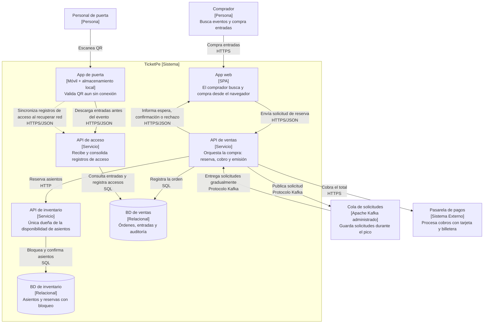

**EC-02**

**EC-02 · La compra responde durante el pico**

**Requisitos de entrada**

| Parte         | Contenido                                                                 |
| ------------- | ------------------------------------------------------------------------- |
| **Fuente**    | Compradores                                                               |
| **Estímulo**  | 120 000 solicitudes de reserva concurrentes                               |
| **Artefacto** | Ruta de compra completa                                                   |
| **Entorno**   | Los 3 primeros minutos de la salida a la venta; se venden 32 000 entradas |
| **Respuesta** | Confirma, rechaza, o informa espera con posición en cola                  |
| **Medida**    | 95 % de solicitudes en ≤ 3 s; ninguna queda sin respuesta                 |

**Mi razonamiento:**

Durante los primeros 3 minutos llegan 120 000 solicitudes, pero solo se venden 32 000 entradas. Si la **API de ventas** intenta atender todas esas solicitudes al mismo tiempo, puede saturarse y dejar compradores sin respuesta.

Por eso se utiliza una **Cola de solicitudes con Apache Kafka**. La **API de ventas** recibe cada solicitud, la agrega rápidamente a la cola y responde al comprador que está en espera. Después procesa las solicitudes gradualmente, sin intentar atender las 120 000 al mismo tiempo.

Kafka se utiliza como un servicio administrado externo, por lo que no agrega otro contenedor a TicketPe.

El comprador siempre recibe una respuesta:

- Si la solicitud puede procesarse inmediatamente, recibe la confirmación o el rechazo
- Si debe esperar, recibe su posición aproximada en la cola
- Si ya no quedan entradas, recibe un rechazo

Cada solicitud tiene un identificador único. Así, si el comprador la envía nuevamente por un problema de conexión, la **API de ventas** reconoce que ya fue recibida y no crea otra reserva.

**Decisión de arquitectura:**

Se agrega **Apache Kafka** como servicio externo. Kafka guarda temporalmente las solicitudes y las entrega a la **API de ventas** al ritmo que esta puede procesarlas.

La **API de ventas** puede ejecutarse en varias instancias durante la salida a la venta. Esto no crea nuevos contenedores: son varias copias desplegadas del mismo contenedor.

**Flujo:**

1. El comprador intenta iniciar una compra desde la **App web**.
2. La **App web** envía la solicitud a la **API de ventas**.
3. La **API de ventas** asigna un identificador a la solicitud y la publica en **Kafka**.
4. La **API de ventas** responde en ≤ 3 segundos indicando que la solicitud está en espera y muestra una posición aproximada.
5. **Kafka** entrega las solicitudes gradualmente a la **API de ventas**.
6. La **API de ventas** solicita la reserva a la **API de inventario**.
7. La **API de inventario** confirma la reserva o la rechaza si el asiento ya no está disponible.
8. La **App web** consulta el resultado y muestra la confirmación o el rechazo. Si se agotan las entradas, se rechazan las solicitudes restantes.

**Que permite cumplir el ≤ 3 segundos?**

- La **API de ventas** guarda rápidamente las solicitudes en Kafka y responde que están en espera, sin procesar las 120 000 reservas al mismo tiempo.
- **Kafka** conserva las solicitudes y las entrega gradualmente para evitar que la ruta de compra se sature.
- La **API de ventas** se escala con varias instancias durante el pico.
- La capacidad se deberia comprobar con una **prueba de carga** de 120 000 solicitudes concurrentes; al menos el 95 % debe recibir una respuesta en ≤ 3 segundos.

**Trazabilidad:**

| Trazabilidad Contenedor     | ¿Por qué existe?                                                                           | Escenario    |
| :-------------------------- | :----------------------------------------------------------------------------------------- | :----------- |
| App web                     | Muestra al comprador la confirmación, el rechazo o su posición en la cola                  | EC-02        |
| API de ventas               | Procesa únicamente las compras admitidas y puede escalar con varias instancias             | EC-01, EC-02 |
| API de inventario           | Reserva cada asiento una sola vez                                                          | EC-01, EC-02 |
| BD de inventario            | Bloquea los asientos para evitar ventas duplicadas                                         | EC-01, EC-02 |
| BD de ventas                | Guarda las órdenes, entradas y registros de acceso                                         | EC-01, EC-05 |
| App de puerta               | Valida entradas localmente en ≤ 1 s aunque no haya conexión                                | EC-05        |
| API de acceso               | Sincroniza los registros de acceso pendientes en ≤ 5 min cuando vuelve la conexión         | EC-05        |
| Cola de solicitudes (Kafka) | Guarda las solicitudes del pico y permite procesarlas gradualmente; es un servicio externo | EC-02        |

La **Cola de solicitudes con Apache Kafka** aparece en el diagrama, pero no se cuenta entre los 7 contenedores.
