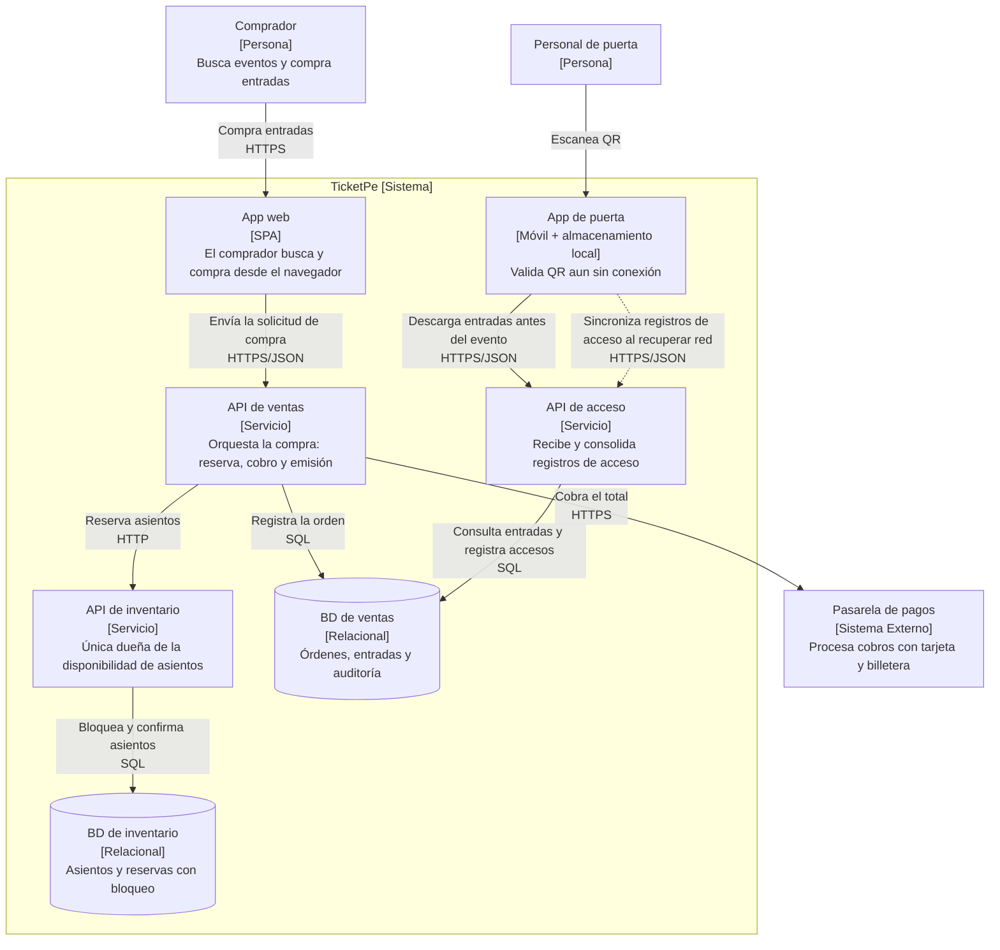

**EC-05**

**EC-05 · La puerta valida sin conexión**

**Requisitos de entrada**

| Parte         | Contenido                                                                                                                                     |
| ------------- | --------------------------------------------------------------------------------------------------------------------------------------------- |
| **Fuente**    | Personal de puerta                                                                                                                            |
| **Estímulo**  | Escanea el código QR de un asistente                                                                                                          |
| **Artefacto** | Aplicación de validación de acceso                                                                                                            |
| **Entorno**   | Puertas del estadio, sin conexión estable, 40 000 ingresos concentrados                                                                       |
| **Respuesta** | Valida el código y marca la entrada como usada                                                                                                |
| **Medida**    | Respuesta en ≤ 1 s aun sin red; ninguna entrada admitida dos veces tras sincronizar; sincronización completa en ≤ 5 min al recuperar conexión |

**Mi razonamiento:**

El personal de puerto escanea el QR en una app de puerta y esta debe validar el codigo y marcar la entrada como usada. La entrada tiene dos estados; HABILITADA y USADA.

La puerta no puede depender SOLO de una llamada a la API para cada escaneo, porque la conexión puede fallar.

Antes del evento, la **App de puerta** descarga los datos necesarios para validar las entradas y los guarda en almacenamiento local cifrado.

Cuando el personal escanea un QR, la aplicación comprueba localmente que:

- el QR sea auténtico y corresponda al evento
- la entrada esté incluida entre las entradas habilitadas
- la entrada todavía no figure como usada en ese dispositivo del **Personal de puerta**

La aplicación comprueba y marca la entrada como **usada** en una única operación dentro del dispositivo. También guarda permanentemente los registros que aún no se han enviado, para sincronizarlos cuando se recupere la conexión.

Al recuperar la conexión, la App de puerta envía los registros de acceso pendientes a la **API de acceso**. Esta API es el único **contenedor que recibe las validaciones de puerta**, **elimina reenvíos mediante un identificador único de operación** porque si la conexión falla, la aplicación puede enviar la misma operación varias veces y **registra cada entrada como usada una sola vez en la BD de ventas**.

La sincronización se ejecuta automáticamente por lotes y con reintentos hasta terminar en un máximo de 5 min.

**Decisión de contenedores:**

Se conserva la arquitectura de EC-01 y se agregan dos contenedores: **App de puerta** y **API de acceso**. El almacenamiento local no se dibuja como otro contenedor porque está embebido y se despliega junto con la app móvil. Funciona junto con la **App de puerta** en el mismo dispositivo.

**Flujo:**

1. Antes del evento, la **App de puerta** descarga y guarda en el dispositivo la lista de entradas habilitadas.
2. Al escanear un QR, la aplicación comprueba en los datos guardados si la entrada está habilitada o ya fue usada. Esta validación funciona sin Internet y responde en ≤ 1 segundo.
3. Si la entrada está habilitada, la aplicación la marca como USADA y guarda un registro de acceso pendiente de enviar.
4. Cuando vuelve Internet, la aplicación envía automáticamente los registros pendientes a la **API de acceso**. Si no recibe una confirmación, intenta enviarlos nuevamente.
5. La **API de acceso** registra el acceso en la **BD de ventas**. Si recibe nuevamente el mismo registro, reconoce que ya fue procesado y no lo guarda dos veces. También rechaza cualquier intento posterior de utilizar la misma entrada.

Desde un punto de vista de contenedores se hace una trazabilidad:

| Trazabilidad Contenedor | ¿Por qué existe?                                                                                                    | Escenario    |
| :---------------------- | :------------------------------------------------------------------------------------------------------------------ | :----------- |
| App de puerta           | Valida entradas y guarda registros de acceso localmente en ≤ 1 s, aunque no haya conexión                           | EC-05        |
| API de acceso           | Recibe y procesa todos los registros pendientes en ≤ 5 min cuando vuelve la conexión, evitando registros duplicados | EC-05        |
| BD de ventas            | Mantiene el estado definitivo de las entradas y registra cada entrada como usada una sola vez                       | EC-01, EC-05 |

La API de acceso se deberia dimensionar y probar para procesar hasta 40 000 registros acumulados en ≤ 5 minutos.

Sin conexión, dos dispositivos no pueden saber si el mismo QR ya fue aceptado por el otro. Para evitarlo, cada entrada debe asignarse a una puerta específica o los dispositivos deben estar conectados mediante una red local.
