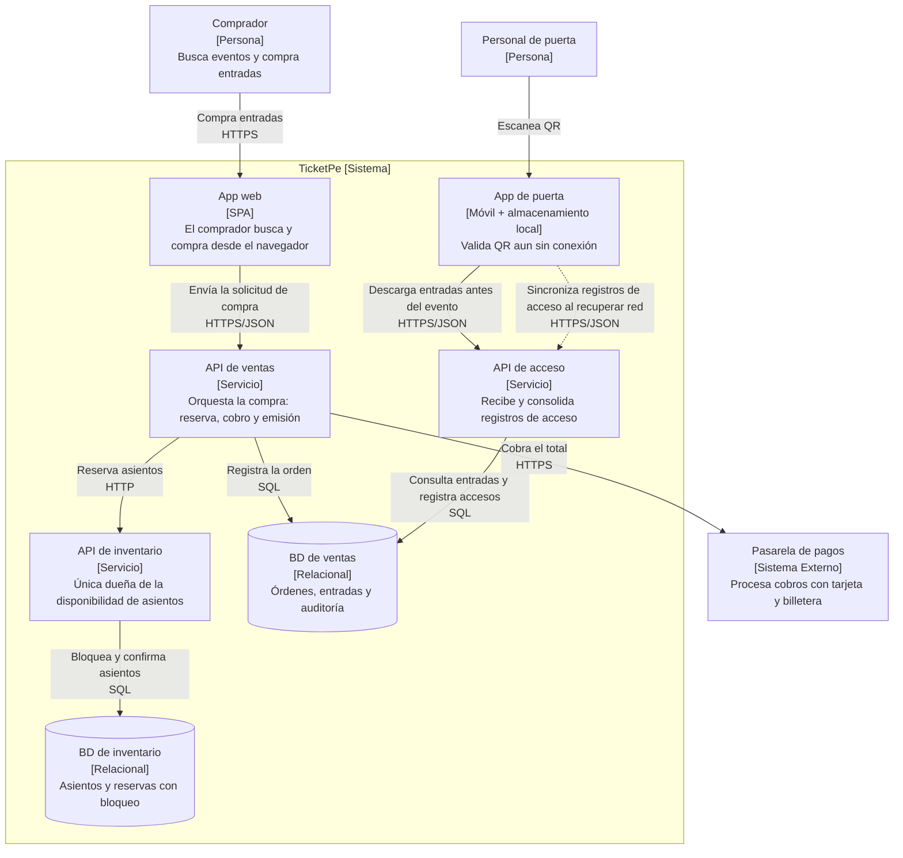

```mermaid
flowchart TB
    Comprador["Comprador<br/>[Persona]<br/>Busca eventos y compra entradas"]
    Personal["Personal de puerta<br/>[Persona]"]
    Pasarela["Pasarela de pagos<br/>[Sistema Externo]<br/>Procesa cobros con tarjeta y billetera"]

    subgraph TicketPe ["TicketPe [Sistema]"]
        Web["App web<br/>[SPA]<br/>El comprador busca y compra desde el navegador"]
        Ventas["API de ventas<br/>[Servicio]<br/>Orquesta la compra: reserva, cobro y emisión"]
        Inventario["API de inventario<br/>[Servicio]<br/>Única dueña de la disponibilidad de asientos"]
        BDInventario[("BD de inventario<br/>[Relacional]<br/>Asientos y reservas con bloqueo")]
        BDVentas[("BD de ventas<br/>[Relacional]<br/>Órdenes, entradas y auditoría")]
        Puerta["App de puerta<br/>[Móvil + almacenamiento local]<br/>Valida QR aun sin conexión"]
        Acceso["API de acceso<br/>[Servicio]<br/>Recibe y consolida registros de acceso"]
    end

    Comprador -->|Compra entradas<br/>HTTPS| Web
    Web -->|Envía la solicitud de compra<br/>HTTPS/JSON| Ventas
    Ventas -->|Reserva asientos<br/>HTTP| Inventario
    Inventario -->|Bloquea y confirma asientos<br/>SQL| BDInventario
    Ventas -->|Registra la orden<br/>SQL| BDVentas
    Ventas -->|Cobra el total<br/>HTTPS| Pasarela

    Personal -->|Escanea QR| Puerta
    Puerta -->|Descarga entradas antes del evento<br/>HTTPS/JSON| Acceso
    Puerta -.->|Sincroniza registros de acceso al recuperar red<br/>HTTPS/JSON| Acceso
    Acceso -->|Consulta entradas y registra accesos<br/>SQL| BDVentas
```
